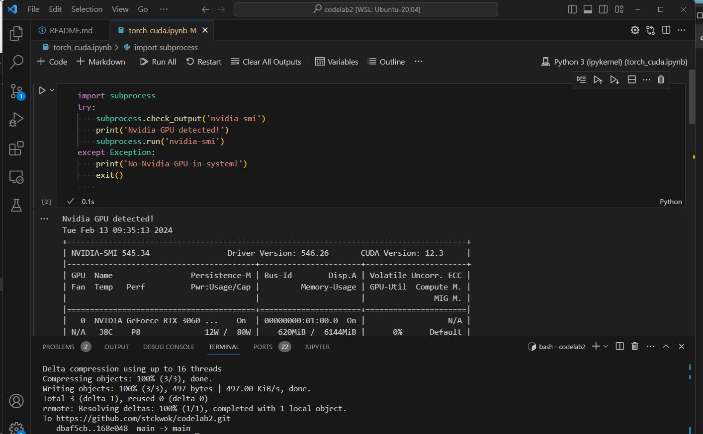

# codelab2

Notebook for RTX-3060 testing using pytorch in Ubuntu or (WSL2).

**Install CUDA toolket**
1. execute apt command from terminal
        'sudo apt-get install nvidia-cuda-toolkit'
2. verify with 'nvcc --version'

```
nvcc: NVIDIA (R) Cuda compiler driver
Copyright (c) 2005-2023 NVIDIA Corporation
Built on Fri_Nov__3_17:16:49_PDT_2023
Cuda compilation tools, release 12.3, V12.3.103
Build cuda_12.3.r12.3/compiler.33492891_0
```

**Setup initial Virtual Env**
1. execute 'python -m venv ~/.venv' to create virtual env
2. activate venv 'source ~/'venv/bin/activate'
3. pip3 install jupyter
4. pip3 install torch torchvision torchaudio

**Launch NoteBook**
1. activate venv
2. launch 'jupyter notebook'
3. note the Server URL
4. open torch_cuda.ipynb at URL from browser or from visual studio code

VS Code (ipykernel)
<!-- 
 -->
[]()
